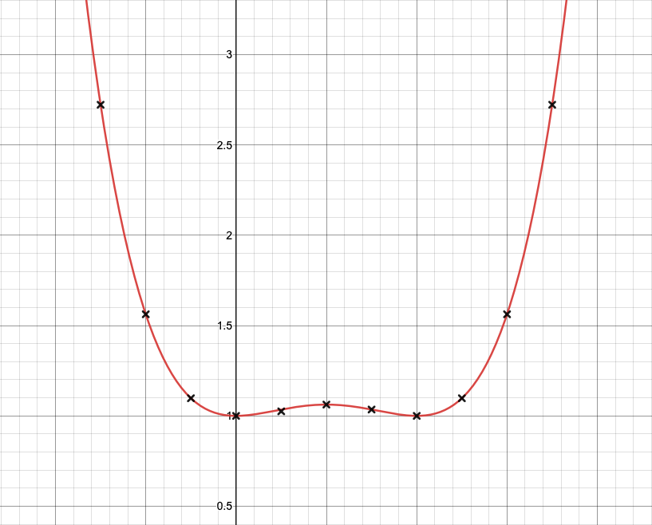

# Assignment 2, Part 2 : Genetic Program

Create a program that implements the genetic programming method to find the equation which fits a set of data (a and b pairs). 

The Terminal Set requires the a coordinate (to find the b) and a static number which represents either the slope or intercept. The Function Set requires the four basic math functions (+,-,÷,x) which can be used to create more specific functions (eg. a^2 = a x a).

The final solution was:

```math
(((a x a) - a) x ((a x a) - a)) + (5.246... ÷ 5.246...)
```

which could be simplified to:

```math
(a^2 - a)^2 + 1
```


Image            | Explanation
:-------------------------:|:-------------------------:
  |  The genetic program was able to find a non-normal quartic equation (red line) that fitted the coordinates (black crosses) perfectly. Notice the hump in the coordinates which is why the equation had to differ.
